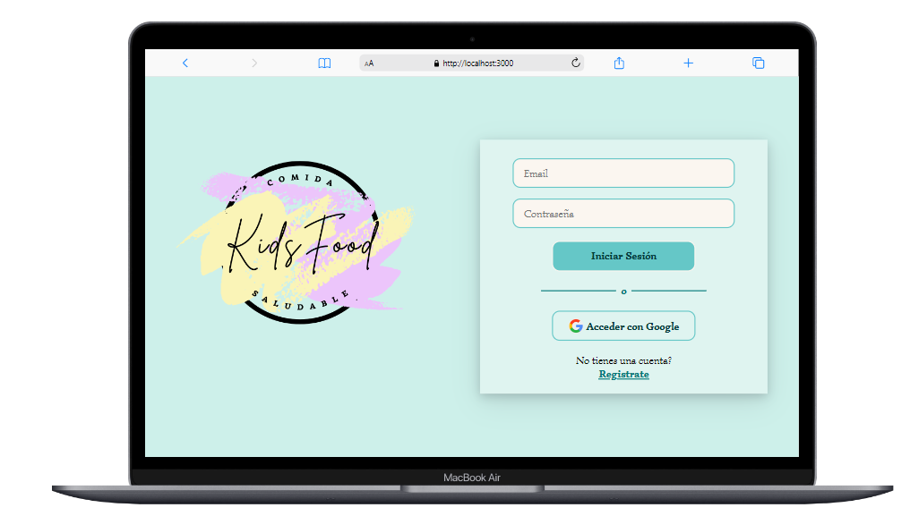
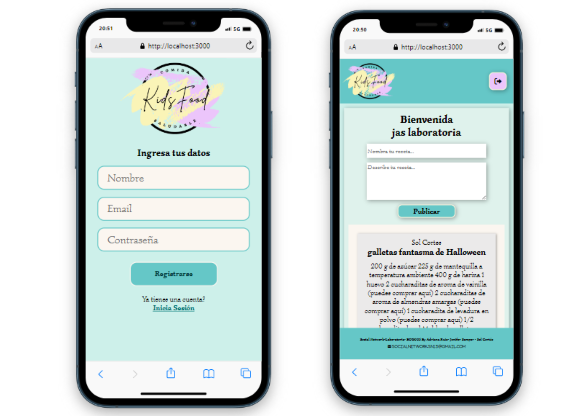
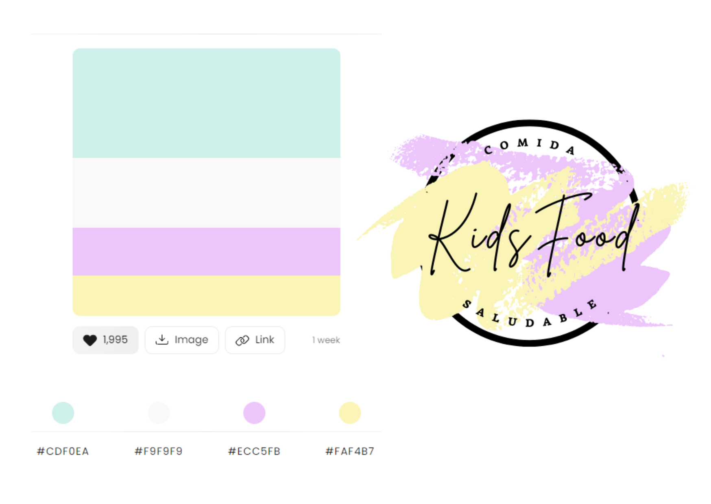
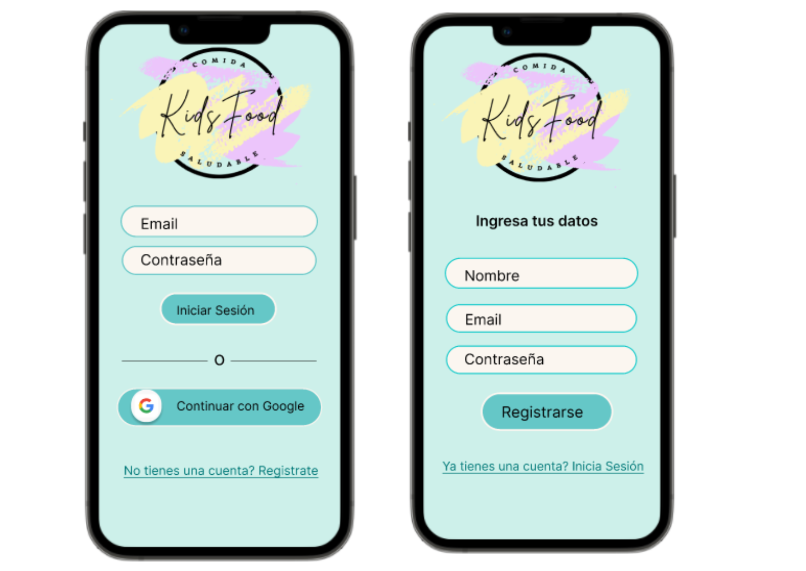
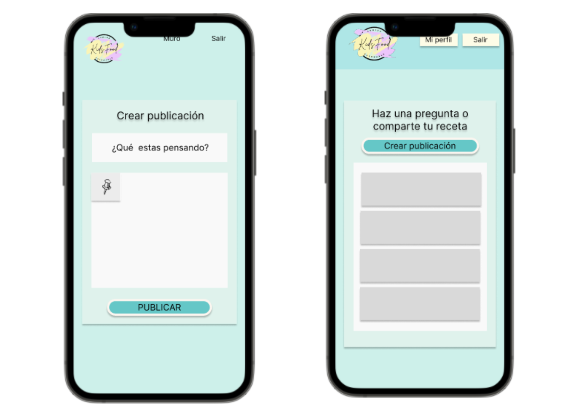
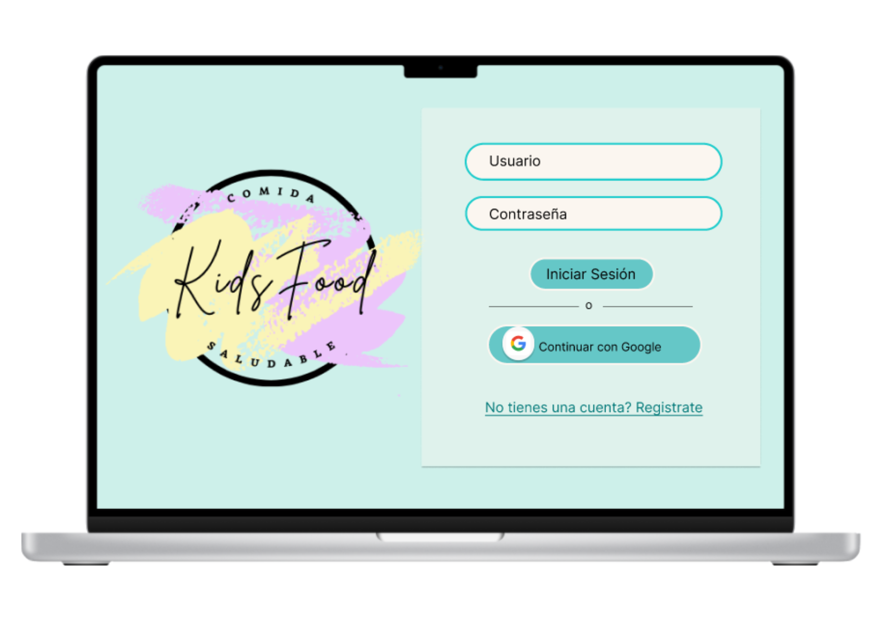

# Kids Foods - Social Network

## Índice

* [1. Introducción](#1-Introducción)
* [2. Historias de Usuario](#2-Historias-de-Usuario)
* [3. Prototipo y guía de estilos ](#3-Prototipo-y-guía-de-estilos)
* [4. Objetivos-Técnicos](#4-Objetivos-Técnicos)
* [5. Test de usabilidad](#5-Test-de-usabilidad)

## 1. Introducción

Kids Foods, es una red social diseñada para crear una comunidad de madres y cuidadores que amen cocinar y brindar la mejor alimentación a sus pequeños, donde puedan compartir todas sus recetas divertidas y saludables e interactuar con otros usuarios mediante likes.

## 2. Historias de Usuario

En este proyecto se busca contruir una red social que le permita a los usuarios crear una cuenta, iniciar sesión con correo electrónico o mediante el botón de google, crear publicaciones , editarlas, eliminarlas e interactuar con otros usuarios por medio de likes.

#### Historia de Usuario 1
YO : como usuario
QUIERO: poder crear un usuario
PARA: poder acceder al contenido de la página.

#### Historia de Usuario 2
YO : como usuario
QUIERO: poder acceder con mi cuenta de Google
PARA: poder acceder al contenido de la página.

#### Historia de Usuario 3
YO: como usuario
QUIERO: poder visualizar el muro
PARA: crear una publicación.

#### Historia de Usuario 4
YO: como usuario
QUIERO: poder visualizar el muro
PARA: poder editar, eliminar y dar like a los post.

## 3. Prototipo y guía de estilos 

Diseñamos un prototipo de alta con ayuda de la herramienta figma para iniciar con la maquetación de la vista de móvil y lo fuimos adaptando para tablet y pc, así mismo escogimos la paleta de colores acorde y diseñamos el logo con ayuda de la herramienta canva.

## 5. Test de usabilidad

Los test de usabilidad se realizaron en todas las vistas del proyecto (móvil, tablet, pc), donde los usuarios pudieron interactuar con click en los diferentes botones y funciones de la página, con el feedback recibido realizamos las siguientes modificaciones.

* Link de registro (Cambio de link solo a la palabra 'Registrate')
* Link de Inicio de Sesión (Cambio de link solo a las palabras 'Inicia Sesión')
* Se modificaron las fuentes y estilos de las letras
* Se modifico el color del botón de salir para que sea más visibles

## 4. Objetivos-Técnicos

En este proyecto implementamos :

* SPA (Single Page Application)
* Vanilla JS
* Responsive (vista móvil,tablet,pc)
* Firebase y Cloud Firestore
* CSS3 y HTML5
* Jest (Test Unitarios)

## Equipo

[Adriana Ruiz](https://github.com/adrianamariaruiz) | [Jenifer Samper](https://github.com/jeniferSamper) | [Sol Cortés](https://github.com/solcortes2018)